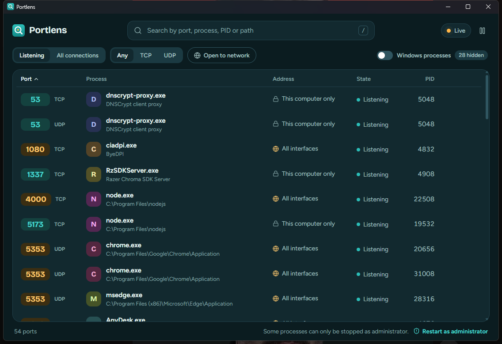

# Portlens

See which program is using a port on Windows, and stop it.

Portlens lists every TCP and UDP socket on your machine together with the process that owns it. Search by port, process name, PID or path, and stop the process behind a port when something is in your way. It is the usual `EADDRINUSE` fix without piecing together `netstat`, `findstr` and `taskkill`.



## Features

- Live list of listening ports and active connections, refreshed every two seconds.
- Search across port, process name, PID, executable path and Windows service names. Type `:80` to match port 80 exactly and not 8080.
- Windows' own ports are hidden by default, so the list shows your programs. One switch brings them back.
- A server bound to both IPv4 and IPv6 appears as one row.
- Ports are marked when other devices on the network can reach them, as opposed to loopback only.
- Details for each port: full path, command line, start time, parent process, hosted Windows services.
- Stops a process, optionally with the programs it started. Critical Windows processes cannot be stopped, and other Windows components ask for a second look first.
- Lives in the system tray. Closing the window hides it; use the tray menu to quit.
- Follows the system light or dark theme.
- A `portlens` command line tool built on the same core.

Keyboard: `/` or `Ctrl+F` to search, `↑` `↓` to move, `Delete` to stop, `Esc` to close the details.

## Install

Download the installer from the [releases page](https://github.com/asimkaya/portlens/releases). Windows 10 and 11 are supported. WebView2, which ships with Windows 11, is required.

The installer is not code signed yet, so SmartScreen may show a warning the first time.

## Command line

```
portlens list                 listening ports, without Windows' own
portlens list --all --system  everything
portlens list --json
portlens who 3000             what is using port 3000
portlens kill 3000            stop it, after asking
portlens kill 3000 --tree -y  stop it and its children, without asking
```

## Permissions

Portlens runs as a normal user and reads the socket tables through the Windows IP Helper API. That is enough to see every port. Stopping a process that belongs to another user or to a service needs administrator rights; the status bar offers to restart Portlens elevated when you need that.

Portlens does not make network connections and collects no data.

## How it works

`crates/portlens-core` calls `GetExtendedTcpTable` and `GetExtendedUdpTable` for the sockets, resolves owners with `sysinfo`, reads executable paths from the kernel when a process cannot be opened, and maps `svchost.exe` to its services through the service control manager. Stopping a process is `TerminateProcess`. Before it runs, Portlens checks that the PID still belongs to the process you were looking at, because Windows reuses PIDs.

The desktop app is Tauri 2 with a React front end in `app/`. The CLI lives in `crates/portlens-cli`.

## Building

You need Rust (stable), Node.js 20 or newer, and the Visual Studio C++ build tools.

```
cd app
npm install
npm run tauri dev       # run the app with hot reload
npm run tauri build     # produce the installer
```

`npm run dev` alone serves the interface in a browser with fake data, which is handy for working on the design.

Run the checks the same way CI does:

```
cargo fmt --check
cargo clippy --workspace --all-targets -- -D warnings
cargo test --workspace
cd app && npm test && npm run build
```

## Contributing

Issues and pull requests are welcome. Read [CONTRIBUTING.md](CONTRIBUTING.md) first.

## License

[MIT](LICENSE)
